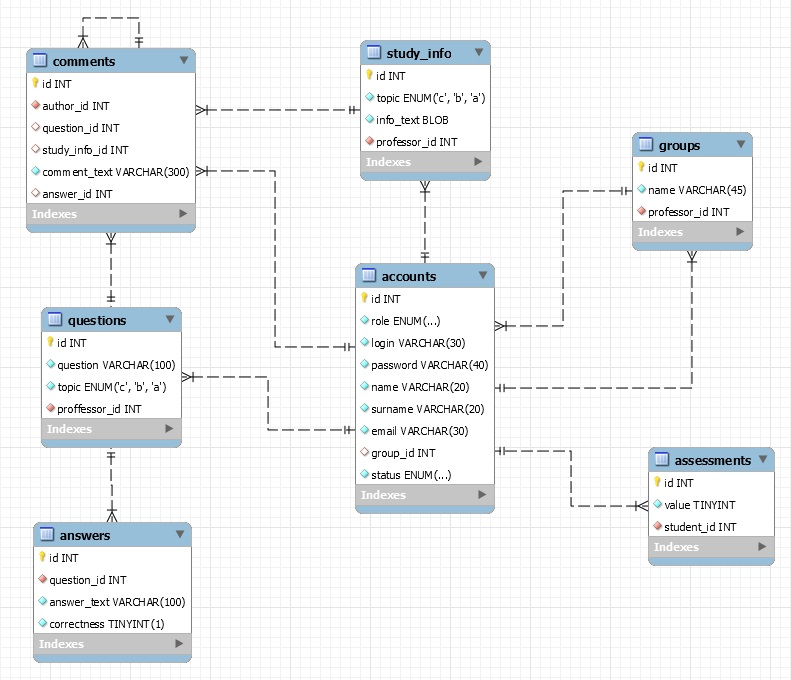
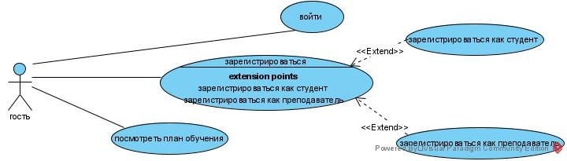
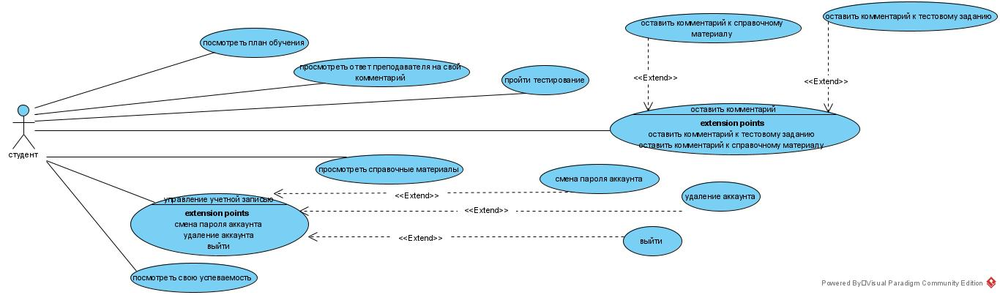
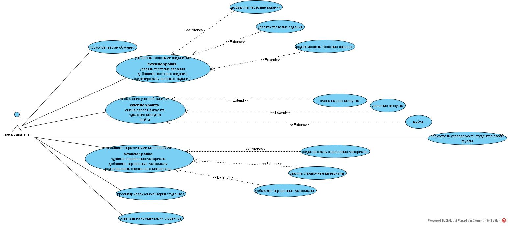
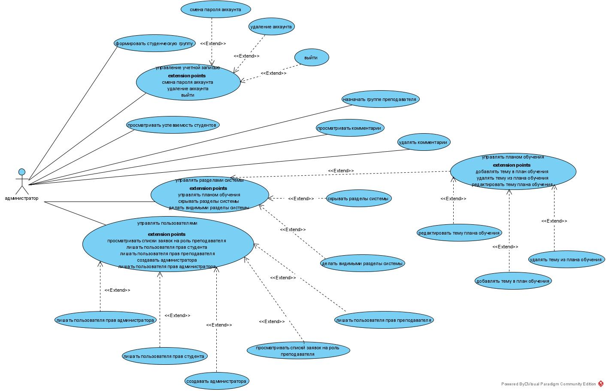

# JavaWebProject
## Обучающий сайт для студентов по дисциплине “Логические основы интеллектуальных систем”

Сайт, который позволяет студентам освоить дисциплину за счет прохождения тестовых заданий и просмотра учебных материалов, преподавателям же сайт позволяет следить за успеваемостью своих студентов и расширять учебный план. Студент может записаться одновременно только на один курс (соответственно состоять в одно время только в одной группе), за который выставляется одна общая оценка. Преподаватель может вести у нескольких разных групп одновременно. После того как преподаватель становится неактивным, его студенты могут просматривать все материалы, которые он написал.

Роль | Действие 
--- | --- 
Гость | 1. Войти;  2. Зарегистрироваться;  3. Посмотреть план обучения. 
Студент | 1. Просмотреть свою успеваемость;  2. Пройти тестирование;  3. Ознакомиться с учебными материалом;  4. Оставить комментарии к тестовым заданиям или к учебным материалам;  5.Просмотреть ответы преподавателя на свои комментарии. 
Преподаватель | 1. Посмотреть успеваемость студентов своей группы;  2. Управлять тестовыми заданиями;  3. Управлять учебными материалами;  4. Просматривать и отвечать на комментарии студентов. 
Администратор | 1. Формировать студенческие группы;  2. Назначать группе преподавателя;  3. Просматривать комментарии и имеет возможность удалять их;  4. Управлять разделами системы;  5. Управлять пользователями.
***
### Схема базы данных

***
### Use-case diagrams
#### Диаграмма деятельности гостя
 
#### Диаграмма деятельности студента
 
#### Диаграмма деятельности преподавателя
 
#### Диаграмма деятельности администратора

